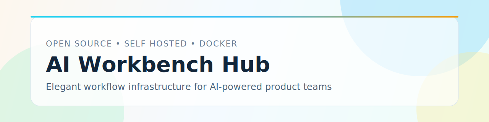

<p align="center">
  <a href="./README.md">简体中文</a> | English
</p>

<p align="center">
  
</p>

<p align="center">
  
  
  
  
  
</p>
# AI Workbench Hub

AI Workbench Hub is an open-source collaboration platform primarily designed for project managers, product managers, engineers, and knowledge workers. It helps teams centrally manage projects, requirements, materials, and conversations through a unified web workspace, supports local Docker deployment and private self-hosting, and enables on-demand secondary development to build a workflow hub that fits real team processes.

## Author

- 千成文

## License

- MIT License (see [LICENSE](./LICENSE))

## Release

- Open-source baseline release

## Features

- Fully Dockerized runtime (`frontend`, `backend`, `mysql`, `redis`, `elasticsearch`, `chroma`)
- Single bootstrap entry for first-time setup
- Built-in first-install seed data (general-tool skills, prompt templates, sanitized MCP configs)
- SemVer-ready release process

## Quick Start (From Clone to Running)

### Official Support Matrix

- Linux + Docker Engine + Docker Compose v2
- macOS + Docker Desktop + Docker Compose v2
- Windows 10/11 + Docker Desktop + Docker Compose v2 (recommended with WSL2/Git Bash for scripts)

### 1. Clone repository

```bash
git clone git@github.com:An374938857/AI-Workbench-Hub.git
cd AI-Workbench-Hub
```

### 2. Check prerequisites

- Docker Desktop / Docker Engine is installed and running
- Docker Compose v2 is available (`docker compose version`)
- On first startup, scripts automatically create `backend/.env` and write `ENCRYPTION_KEY` (no manual editing required)
- If a placeholder/invalid key is detected (for example `your-fernet-key-here`), scripts will auto-replace it with a valid Fernet key
- The following host ports are available:
  - `15173` (frontend)
  - `18080` (backend)
  - `13306` (mysql)
  - `16379` (redis)
  - `19200` (elasticsearch)
  - `18000` (chroma)

### 3. First-time initialization and startup (production mode)

```bash
./scripts/bootstrap.sh
```

`bootstrap.sh` will automatically:

1. Start all required containers
2. Wait for service health checks
3. Build `backend/frontend` images on first run (with retry)
4. Run database migration (`alembic upgrade head`)
5. Initialize Elasticsearch indices
6. Create default admin account
7. Import open-source seed data (idempotent)
8. Start backend and frontend

### 4. Access application

- Frontend: `http://localhost:15173`
- Backend health: `http://localhost:18080/api/health`

Default admin credentials:

- username: `admin`
- password: `admin123`

### 4.1 Minimal Install Verification (recommended on first run)

```bash
curl -fsS http://localhost:18080/api/health
curl -fsS http://localhost:15173 >/dev/null
```

If both commands succeed, clone-to-running installation is healthy.

### 4.2 Missing Table Troubleshooting (500 on send message)

If login succeeds but sending a message returns HTTP 500, first verify that critical tables exist:

```bash
docker compose -f docker/docker-compose.yml -f docker/docker-compose.prod.yml \
  exec -T mysql mysql -uroot -ppassword -D ai_platform -e \
  "SELECT table_name FROM information_schema.tables \
   WHERE table_schema='ai_platform' \
     AND table_name IN ('conversation_compression_logs','custom_commands','model_fallback_configs','model_fallback_logs','model_comparisons');"
```

One-command repair:

```bash
./scripts/bootstrap.sh --prod
```

Note: “model connectivity test passed” in Admin Console only verifies model API reachability. It does not guarantee the full conversation runtime path, which also depends on DB schema and compression context flow.

If you see `failed to fetch anonymous token ... EOF`, this is usually a transient Docker Hub network issue. Scripts already retry automatically; if it still fails, run:

```bash
docker pull python:3.11-slim
```

### 5. Daily startup (non-first-run)

```bash
./scripts/start.sh
```

### 6. Development mode (hot reload)

```bash
# First-time dev bootstrap
./scripts/bootstrap.sh --dev

# Daily dev startup
./scripts/start.sh --dev
```

### 7. Explicit rebuild

```bash
# Build on startup
./scripts/start.sh --build

# Force rebuild (down + build + up)
./scripts/restart.sh --rebuild
```

## Upgrade from V1.0.0 to V1.0.1 (Seamless)

Yes, upgrade is seamless. In `V1.0.1`, migrations and seed import are idempotent and do not wipe existing business data.

Recommended upgrade steps:

```bash
# 1) Fetch code and tags
git fetch --all --tags
git checkout V1.0.1

# 2) Optional: set key if you want Aliyun Coding Plan to be usable immediately
export RELEASE_ALIYUN_CODING_PLAN_API_KEY='your-api-key'

# 3) Run upgrade flow (migrate + index init + admin check + idempotent seeds)
./scripts/bootstrap.sh --build
```

If you only want code/image refresh without initialization flow:

```bash
./scripts/restart.sh --build
```

## Admin Console (Quick Guide)

After logging in with the admin account:

1. Click the user avatar at the top-right corner
2. Open the **Admin Console**
3. In Admin Console, you can:
   - Configure model providers and model routing rules
   - Manage skills (create/edit/enable/disable)
   - Manage MCP-related capabilities and settings

## Daily Operations

```bash
# Start (default production mode)
./scripts/start.sh

# Start in development mode
./scripts/start.sh --dev

# Restart
./scripts/restart.sh

# Restart in development mode
./scripts/restart.sh --dev

# Force rebuild
./scripts/restart.sh --rebuild

# Stop
./scripts/stop.sh

# Stop development mode
./scripts/stop.sh --dev

# Restart backend only
./scripts/restart-backend.sh
```

## Architecture

- Frontend: Vue 3 + Vite (dev mode) / Nginx static hosting (prod mode)
- Backend: Python 3.11 + FastAPI + SQLAlchemy + Alembic
- Storage: MySQL 8.0 + Redis 7 + Elasticsearch 8 + Chroma

## Configuration

Configuration is auto-initialized by startup scripts (missing `backend/.env` and required keys are auto-created). You can still customize values based on `backend/.env.example`.

Image/package acceleration (China-friendly defaults):

- Docker image prefix defaults to `docker.m.daocloud.io`
- Backend build defaults to `APT_MIRROR=mirrors.aliyun.com`
- Backend Python deps default to `PIP_INDEX_URL=https://mirrors.aliyun.com/pypi/simple`
- Frontend Node deps default to `NPM_REGISTRY=https://registry.npmmirror.com`

To switch back to official upstreams, create project-root `.env` (see `.env.example`) and set:

```bash
DOCKER_REGISTRY_MIRROR=docker.io
# Optional overrides:
# APT_MIRROR=deb.debian.org
# PIP_INDEX_URL=https://pypi.org/simple
# PIP_TRUSTED_HOST=pypi.org
# NPM_REGISTRY=https://registry.npmjs.org
```

Important runtime variables:

- `DATABASE_URL`
- `REDIS_URL`
- `ELASTICSEARCH_URL`
- `CHROMA_URL`
- `JWT_SECRET_KEY`
- `ENCRYPTION_KEY` (required, bootstrap fails when missing)
- `RELEASE_ALIYUN_CODING_PLAN_API_KEY` (optional, injected into Aliyun Coding Plan during first bootstrap)

### Model Provider Configuration

- The platform supports any model provider compatible with:
  - `openai_compatible`
  - `anthropic`
- The open-source seed initializes `Aliyun Coding Plan` and its model list by default.
- To make it usable right after deployment, set the API key before bootstrap:

```bash
export RELEASE_ALIYUN_CODING_PLAN_API_KEY='your-api-key'
./scripts/bootstrap.sh --build
```

- You can then add more OpenAI-compatible or Anthropic-compatible providers/models in the Admin Console.

## Migrations

- Baseline migration starts at `backend/migrations/versions/001_baseline.py`
- For future releases, add incremental Alembic revisions only

## Project Policies

- No personal business data in repository
- Open-source seed only contains sanitized MCP config (`Authorization=<REQUIRED>`), authorization must be provided by users
- Release process follows SemVer and changelog discipline

## Documentation

- [CONTRIBUTING.md](./CONTRIBUTING.md)
- [CHANGELOG.md](./CHANGELOG.md)
- [RELEASE.md](./RELEASE.md)
- [SECURITY.md](./SECURITY.md)
- [LICENSE](./LICENSE)

## README Files

- `README.md`: default Chinese README on GitHub
- `README.en-US.md`: English README
